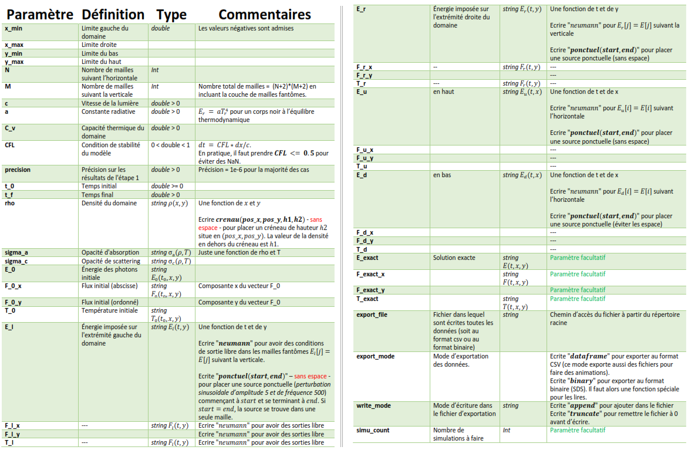
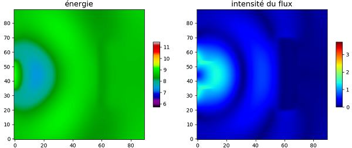

# Problème Inverse (MOCO): Transfert Radiatif et VNET

### Objectif
Résolution du problème de propagation de la lumière par la méthode des volumes finis en 2D et apprentissage de la densité par un réseau de neurones (VNet).

### Documents
- Indications et travail à faire: 
    - `doc/guidelines/projetM1.pdf` 
    - `doc/guidelines/csmi-moco.ipynb`  

 

## __1ère partie: Simulation de l'EDP__    

_Les commandes indiquées sont à exécuter à partir du répertoire racine du projet._

### Compilation
Utiliser CMake:   
- __`rm -rf build`__
- __`cmake -H. -Bbuild`__  
- __`cmake --build build`__  

### Exécution
- Pour une simple exécution : __`build/transfer src/config/simu_pd.cfg`__ 
- Pour faire une série de simulations : __`bash src/simu/data_dump.sh`__ 

#### Format des fichiers de configuration (`data/img/config.pdf`)   

<!--  -->

### Formats possibles de sauvegarde
- __`csv`__: CSV pour les signaux exportés.
- __`sds`__: binaire SDS (source-densité-signal) pour la sauvegarde d'une série de simulations.

### Visualisation des résultats
- Visualisation des données: `notebook/VisualisationDesDonnées.ipynb`
  
<!--  -->

 

## __2ème partie: Reconstruction de la densité (VNET)__   

### Préparation des données  
- Creation des densités: `notebook/CreationDesDonnees.ipynb`
- Traitement des donnes: `notebook/TraitementDesDonnees.ipynb`

### Apprentissage  
- Régression: `notebook/Regression.ipynb`

 

## Ressources utilisées

- __muParser__: pour transformer des expressions en fonctions: [Exemple](https://beltoforion.de/article.php?a=muparser&s=idExample#idExample) - [Instructions](https://beltoforion.de/article.php?a=muparser&p=building)

- __cnpy__: pour utiliser les tenseurs Numpy en C++ : [Description](https://github.com/rogersce/cnpy) - [Utilisation](https://rancheng.github.io/npy-cpp/)  
Pour utiliser **cnpy**, il faudra installer la librarie **zlib** à travers: `sudo apt-get install zlib1g-dev`)
